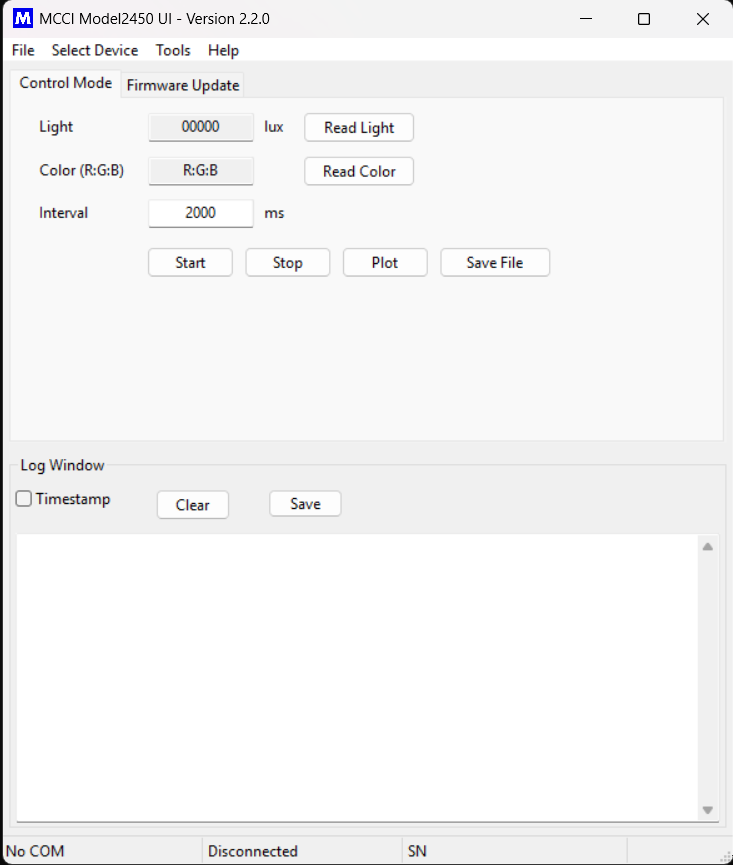
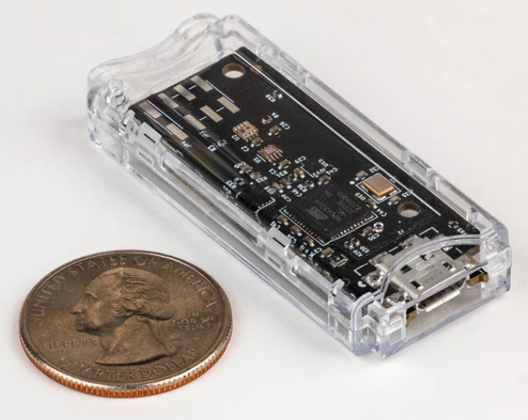

# model2450-ui

A wxPython-based desktop user interface for configuring, monitoring, and managing the Model 2450 device.

This application provides tools for device communication, calibration, firmware update, data handling, and reporting.

<!-- /TOC -->

## About the Application

This application is a simple interface for MCCI Model2450. its support manual testing of Model 2450 Brightness and Color kit.

## Prerequisites for running or building

### Windows

Development environment

* OS - Windows 11 64 bit
* Python - >= 3.10
* wxPython - 4.2.1
* xlsxwriter - 3.2
* pyserial - 3.4

Download [python3.10](https://www.python.org/ftp/python/3.10.11/python-3.10.11-amd64.exe) and install.

```shell
pip install wxpython
pip install pyserial
pip install xlsxwriter
```

### Linux OS

```shell
pip3 install wxpython
pip3 install pyserial
pip3 install xlsxwriter
```

### Mac OS

```shell
pip3 install wxpython
pip3 install pyserial
pip3 install xlsxwriter
```

## Model2450 API Library

`model2450lib` api is a python library, this libabry intract with `Model 2450 UI`

* download the model2450 from here [model2450lib](https://github.com/mcci-usb/model2450lib)
* To install the library using below command and [install package](https://github.com/mcci-usb/model2450lib#installing-model24500-package) in `Windows OS`.


```shell
pip install . 
```

* download the model2450 from here [model2450lib](https://github.com/mcci-usb/model2450lib)
* To install the library using below command and [install package](https://github.com/mcci-usb/model2450lib#installing-model24500-package) in `Linux Os`.

```shell
sudo pip3 install . 
```

* download the model2450 from here [model2450lib](https://github.com/mcci-usb/model2450lib)
* To install the library using below command and [install package](https://github.com/mcci-usb/model2450lib#installing-model24500-package) in `Mac Os`.

```shell
pip3 install . 
```

Please navigate to dist/ directory and you will find the files .egg file. Example: model2450lib-1.0.0-py3.7.egg

### How to use the package

here provide the REAMDME.md information about Model2450 lib please follow the instrunctions [README](https://github.com/mcci-usb/model2450lib/edit/main/README.md)

## Running the code for model2450UI

Move to the directory `destdir/src/`

Run the below command

For Windows:

```shell
python main.py
```

For linux OS:

```shell
python3 main.py
```
For Mac OS:

```shell
python3 main.py
```

## Version change process

To update the version for each release

* Move to the directory `destdir/src/`
* Open the file `uiGlobals.py`
* Update the value of the String Macro `APP_VERSION`
* Update the VERSION.md `destdir/VERSION.md`

## GUI Preview



## Supported Products

### MCCI Model 2450 Brightness and Color Kit

the Model 2450 allows you to test the Brightness and color of video displays on Windows.

**Link:** For more information, see the [product home page](https://store.mcci.com/products/model-2450-brightness-and-color-kit).



## Release History

- v2.2.0 Release Model 2450 UI

    - [#13 controlwindows alighnment](https://github.com/mcci-usb/model2450-ui/commit/856c256e0e232b7bc26b41a72a9a15ab6d0225b9)

    - [#12 wrong hex file deduction](https://github.com/mcci-usb/model2450-ui/commit/a6b3fa962fdfc5d85c3062aa74248b673f8a7af9)

    - [#8 update Headers](https://github.com/mcci-usb/model2450-ui/commit/1ff49d0f5856ca6bd4be3e3080a4b3f179468e30)

- v2.0.0 Release Model 2450 UI

    -  [#4 adding plotting for stream ](https://github.com/mcci-usb/model2450-ui/commit/d837fcad54a1a84dd0a923c8f14cc0e69c29011c)
    -  [#6 Model2450 search](https://github.com/mcci-usb/model2450-ui/commit/e47b86699ee8f850378dfbb29ad00de6c4a3fdc9)
    - [#7 Add Timestampe](https://github.com/mcci-usb/model2450-ui/commit/cb856f3cb22b2ad906e27d251c203b86fca10121)

- v1.0.0 initial release of Model 2450 UI.

    - Initial Release.

### Support Open Source Hardware and Software

MCCI invests time and resources providing this open source code, please support MCCI and open-source hardware by purchasing products from MCCI and other open-source hardware/software vendors!

For information about MCCI's products, please visit [store.mcci.com](https://store.mcci.com/).

### Trademarks

MCCI and MCCI Catena are registered trademarks of MCCI Corporation. USB4, USB Type-C and USB-C are registered trademarks of USB-IF. All other marks are the property of their respective owners.

<!-- markdownlint-disable-file MD004 -->