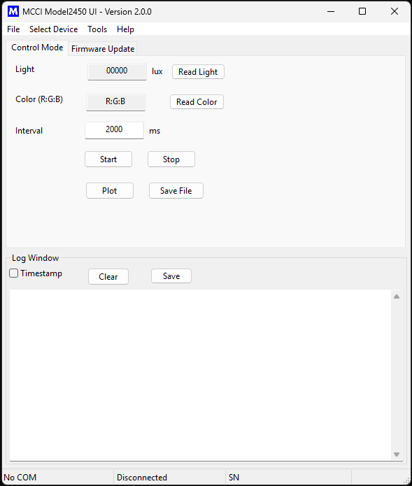

# model2450-ui
A cross functional User Interface application to control the Model 2450 Brightness and Color kit

<!-- /TOC -->

## About the Application

This application is a simple interface for MCCI Model2450. its support manual testing of Model 2450 Brightness and Color kit.

## Prerequisites for running or building

### Windows

Development environment

* OS - Windows 11 64 bit
* Python - 3.7.6
* wxPython - 4.2.1
* pyserial - 3.4

Download [python3.7.6](https://www.python.org/downloads/release/python-376/) and install.

```shell
pip install wxpython
pip install pyserial
```

## Model2450 API Library

`model2450lib` api is a python library, this libabry intract with `Model 2450 UI`

* download the model2450 from here [model2450lib](https://github.com/mcci-usb/model2450lib)
* To install the library using below command and [install package](https://github.com/mcci-usb/model2450lib#installing-model24500-package) in `Windows OS`.

```shell
python setup.py install
```

Please navigate to dist/ directory and you will find the files .egg file. Example: model2450lib-1.0.0-py3.7.egg

### How to use the package

here provide the REAMDME.md information about Model2450 lib please follow the instrunctions [README](https://github.com/mcci-usb/model2450lib/edit/main/README.md)

## Running the code for model2450UI

Move to the directory `destdir/src/`

Run the below command

For Windows:

```shell
python main.py
```

## Version change process

To update the version for each release

* Move to the directory `destdir/src/`
* Open the file `uiGlobals.py`
* Update the value of the String Macro `APP_VERSION`
* Update the VERSION.md `destdir/VERSION.md`

## GUI Preview



## Supported Products

### MCCI Model 2450 Brightness and Color Kit

the Model 2450 allows you to test the Brightness and color of video displays on Windows.

**Link:** For more information, see the [product home page](https://store.mcci.com/products/model-2450-brightness-and-color-kit).


## Release History

- v1.0.0 initial release of Model 2450 UI.

    - Initial Release.

### Support Open Source Hardware and Software

MCCI invests time and resources providing this open source code, please support MCCI and open-source hardware by purchasing products from MCCI and other open-source hardware/software vendors!

For information about MCCI's products, please visit [store.mcci.com](https://store.mcci.com/).

### Trademarks

MCCI and MCCI Catena are registered trademarks of MCCI Corporation. USB4, USB Type-C and USB-C are registered trademarks of USB-IF. All other marks are the property of their respective owners.

<!-- markdownlint-disable-file MD004 -->